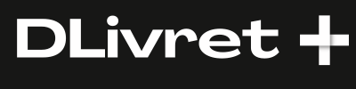

  

**A simple and accessible DApp to save and invest in DeFi**

DLivret is a **micro-savings** and **decentralized finance (DeFi) investment** platform designed for beginners. The goal is to provide a **clear and more profitable alternative to traditional savings accounts**, while making DeFi more accessible.

## 🚀 Key Features

- **Optimized and accessible savings**  
  A simple and transparent solution offering competitive returns compared to traditional financial products.

- **User-friendly and intuitive DApp**  
  A clean and smooth interface designed for beginners, with no technical jargon.

- **Built-in learning tools**  
  Educational content to understand opportunities, risks, and how crypto yields work.

## 🎯 Our Mission

To democratize decentralized finance by making it **accessible, educational, and efficient**.

## 🛠️ Project Structure

The project is divided into two main folders:

### Backend (`/backend`)

- Built with **Hardhat**
- Contains:
  - **Smart contracts**
  - **Unit tests**
  - **Deployment scripts**
  - **Utility scripts**

### Frontend (`/frontend`)

- Developed using **Next.js**
- Contains:
  - All **UI components**
  - The **frontend architecture**
  - Contract interaction and data integration

---

> 💡 This project is currently under development...
